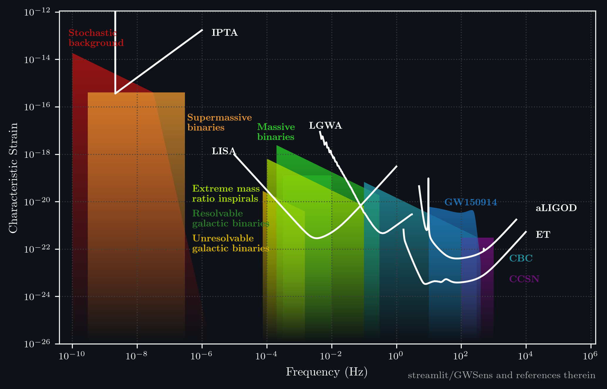

# GWSens

[](https://app-gwsens.streamlit.app/)

Interactive gravitational wave sensitivity curve plotter.



## Features

- Plot detector sensitivity curves and GW sources
- Light/Dark themes
- Customizable labels, colors, and positions
- Export to PNG, PDF, SVG, JPEG
- LaTeX rendering support

## Quick Start

```bash
pip install -r requirements.txt
streamlit run app.py
```

## Data

Add custom detectors/sources by placing CSV files in `data/detectors/` or `data/sources/` and updating `config.py`.

## References

Inspired by [gwplotter.com](http://gwplotter.com/)

